# GNSS-SDR with a RFSoC IC

### Contributor: Jorge Iglesias | Mentor: Javier Arribas | Organization: GNSS-SDR
Google Summer of Code (GSoC) is a global, online program focused on bringing new contributors into open source software development. I have been a contributor to the GNSS-SDR project (https://gnss-sdr.org/) with my **Advanced multi-band GNSS SDR front-end implementation in an RFSoC integrated circuit**. This project has been tested on the RFSoC4x2 as well as the ZCU208. For further information, please do not hesitate to contact me (jorgeiglesiascostas@gmail.com). 

## Introduction
Nowadays, a superheterodyne analog front-end is normally used to receive carrier signals of the order of GHz. The radio frequency (RF) signal is translated to an Intermediate Frequency (IF), to finally obtain it in baseband. This technique has some well-known inherent limitations, such as the image frequency problem that limits the available bandwidth and the number of required analog components. Direct-to-baseband conversion technique removes some of the superheterodyne limitations, however it still requires analog filters and mixers.  In the area of radio navigation receivers, in a near future, when we want to provide a universal navigation system suitable for multi-band and multi-constellation operation and flexible enough to upgrade its capabilities by a firmware update, it is necessary to change this technology. For this reason, the future of front-ends involves using systems that have Analog-to-Digital Converters (ADCs) on the order of Giga Samples Per Second (GSPS) where the signal received by the antenna is amplified and sampled, and all the processing is done in the digital domain. This technology is referred as direct-RF sampling in the literature. An example of this type of system is the advanced multi-band Global Navigation Satellite System (GNSS) Software Defined Radio (SDR) front-end designed in this project using a Radio Frequency System-on-Chip (RFSoC).

### GNSS
GNSS is used to describe any satellite navigation system with global or regional coverage. Satellite navigation systems transmit highly precise geolocation information to GNSS receiving devices to determine its current location. The proposed multi-band RFSoC front-end digital baseband sample stream will be connected to a GNSS-SDR receiver in real-time. Figure 1 shows all the bands, depending on the frequency they use and the constellation [15] to which they belong.

*Figure 1: GNSS constellations, bands and frequencies.*

The open source GNSS-SDR project allows implementing a SDR receiver to perform global satellite navigation using the C++ language. It implements the GNSS receiver software by creating a graph where the nodes are signal processing blocks and the lines represent the dataflow between them and, for that reason, it is used in this project. Figure 2 shows the general block diagram GNSS-SDR open-source project.

*Figure 2: General block diagram GNSS-SDR open-source project [16].*

### RFSoC
ZYNQ Ultrascale+ RFSoC processor takes advantage of the high signal acquisition performance that Field Programmable Gate Arrays (FPGAs) provides and the computing power that Central Processing Units (CPUs) offers [1][2][7][11][12][13][17]. A SoC is an integrated circuit that brings together all the necessary components to process the received signal on a single piece of silicon. The RFSoC device is mainly divided by two parts: the Processing System (PS) and the Programmable Logic (PL). The PS is the equivalent of the CPU and the PL of the FPGA. The PL can be reprogrammed using Very High Speed Integrated Circuit Hardware Description Language (VHDL). The integrated ADCs [10] are capable of sampling signals up to 5 GSPS, and that is the reason why it is used for this project, since it is possible to sample radio signals directly from the antenna without any external front-end. Each ADC has a Digital Downconverter (DDC) to perform the translation of a high frequency RF signal to baseband. The PS executes instructions of an operating system and/or an application written with PYNQ. The PS incorporates the multiple processor cores of a Multi-Processor SoC (MPSoC). The architecture includes a quad-core APU, a dual-core RPU, a PMU and a CSU, and also contains local memories, interconnects and peripheral interfaces. Figure 3 shows the RFSoC4x2 [18] development board used.

*Figure 3: RFSoC4x2 development board components.*

### Multi-band
A multi-band front-end implies that it is capable of simultaneously processing several bands, allowing the final device that receives not only to operate with different types of satellites, but also that the position estimates will be better, since it will be able to use more satellites at the same time. To obtain the desired bands, a first translation of the entire GNSS band to the baseband is made. Then the signal goes through different processing chains. Each one is responsible for transferring a single band to the baseband. Figure 4 shows the modifications that the GNSS signal would suffer if two translations to baseband are performed. Figure 5 is the diagram of the multiple processing chains.

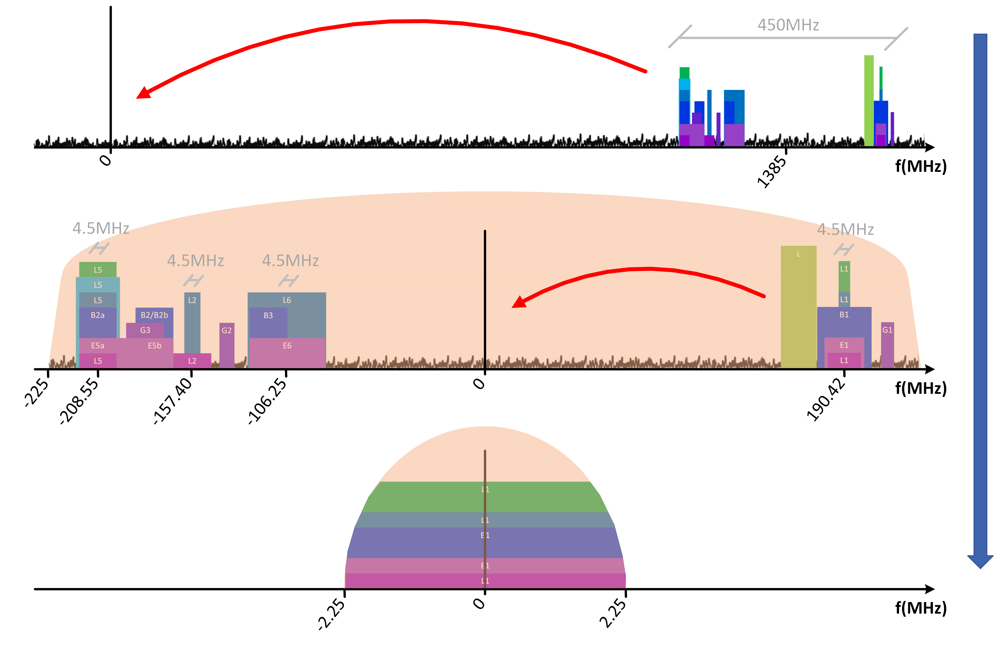
*Figure 4: Two translations to baseband to select GPS L1.*

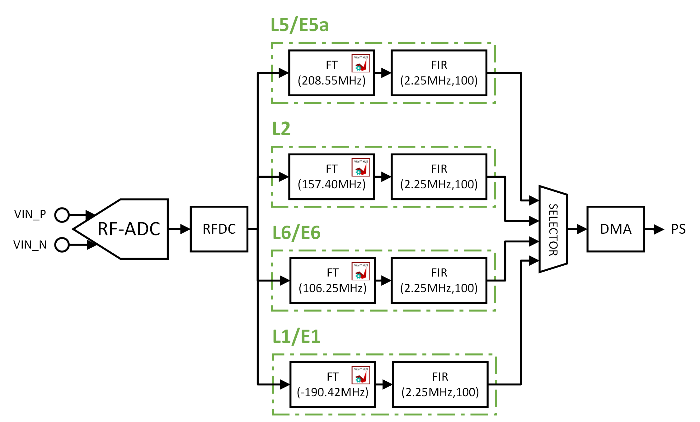
*Figure 5: Multiple processing chains diagram.*

## Objectives
The main objective of this project is the design and the implementation of an advanced multi-band GNSS SDR front-end, equipped with the following features and specifications:
- No translation stage to IF.
- SDR
- Multi-band
- Easy update
- No sample losing

## SDK and Software frameworks
The Zynq Ultrascale+ RFSoC processor, being a SoC system, has several programming stages, which mainly differ in programming the PS, the PL and the connection between the two. While the PL requires several HDL-dedicated software, the PS and part of the processor connection are mainly implemented in Python through an open source framework called PYNQ [6][14][20][21]. Figure 6 shows the differents softwares that were used to control the RFSoC processor.

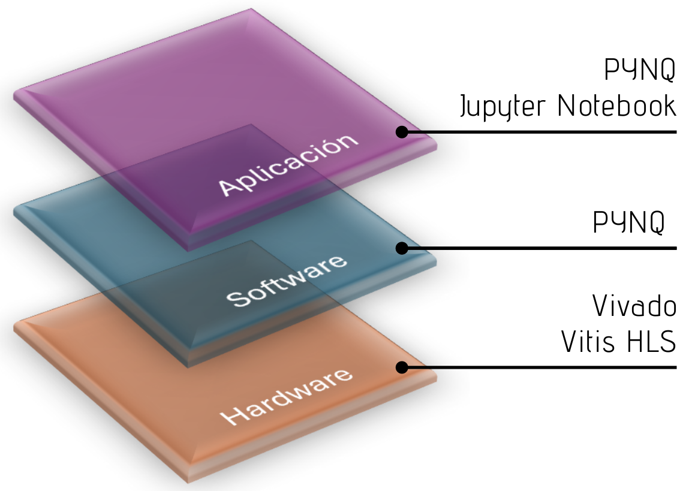
*Figure 6: The different software layers of the RFSoC processor.*

## Design and Implementation
The direct RF sampling capability of RFSoC integrated circuits enables the implementation of a novel multi-band GNSS SDR front-end receiver. The available RF bandwidth is sufficient to simultaneously process all GNSS signals, using only one ADC from the RFSoC4x2. Figure 7 shows a single signal processing chain that is composed of (left to right): the RFDC, the Frequency Translator (FT), the FIR IP core and the DMA. The GNSS signal goes through a series of transformations as it is processed by different blocks of the diagram:
1. ADC: The signal goes from being analog to digital from the ADC.
2. RFDC: The signal goes from being real to IQ complex and is translated to baseband, through which the complex multiplier and the NCO of the DDC of one of the dual tile receivers frequently move the signal from its original centre frequency to 0Hz. Then,the signal is filtered by the corresponding programmable decimator, reducing its sample rate.
3. Frequency Translator: A second baseband drop is produced from complex multipliers and NCOs so that the user can choose the desired frequency band within the one that had already been selected.
4. FIR filter: The second filtering and decimation process is done by the FIR IP core. In this stage, the signal passes through a Low Pass Filter (LPF) type FIR filter which occupies a bandwidth of half the number of samples per second that the user want the end of the reception chain to go to.
5. DMA: From the DMA the processed signal is sent to the CPU memory and from it, to the Ethernet port connected to the PS CPU and this will transfer the data to the device which will use the desired signal from the receiver.

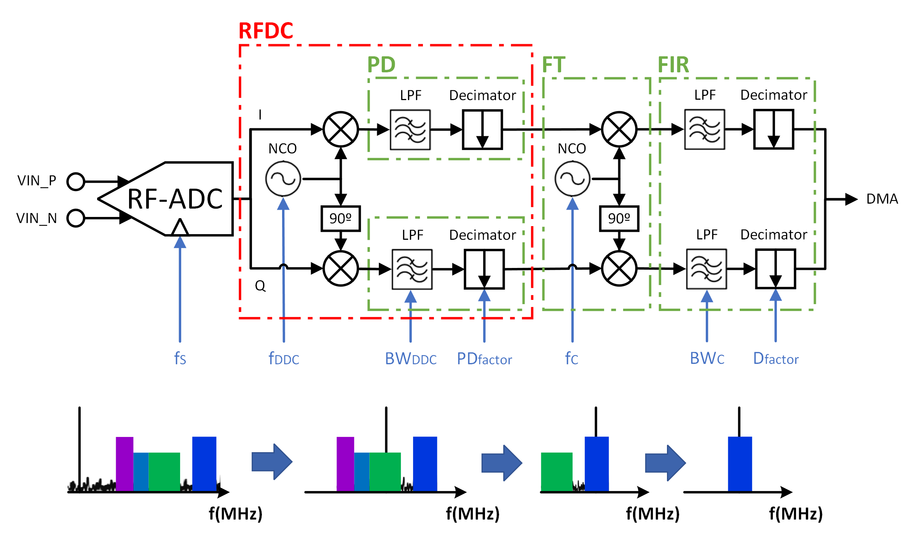
*Figure 7: A single processing chain diagram.*

The PL scheme of the project can be mainly divided into two parts. The first part consists of processing the input signal using the hardware blocks provided by the RFSoC itself together with the base overlay. An overlay is a programmable FPGA design that contain all the information about the hardware blocks called Intellectual Property (IP) cores and how they relate to each other as if it were a hardware library. The second part consists of using the set of IP cores of the BaseOverlay, and custom-made SDR IP cores coded with Vitis HLS [8] to process the antenna input signal and extract the desired GNSS bands. Figure 8 shows the RFSoC4x2 BaseOverlay.

*Figure 8: RFSoC4x2 BaseOverlay hardware layer [19].*

### RFDC
The RFDC IP core, is probably the most complex and characteristic block of an RFSoC, since from it all the functionalities related to the ADCs, DACs, DDCs and DUCs are configured. For this reason, it not only modifies the internal logic part of the processor that directs all the RF processes, but it also has to have a high temporal precision to not desynchronize any sample of the signal to be sent or received. The advantage of using the RFDC is that it configures in a simple and compact way both the functionalities to transfer the GNSS frequencies to baseband and those related to the programmable decimator. Figure 9 has been made to explain what a single Dual Tile contains. Also, Figure 10 shows the tile configuration and Figure 11 shows the clocking configuration.

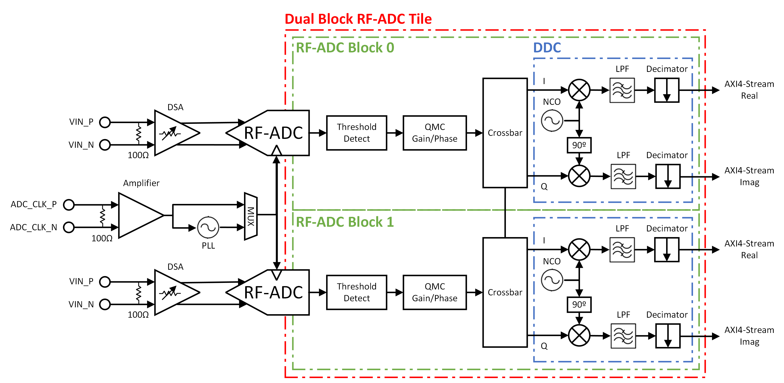
*Figure 9: RF-ADC Tile hierarchy for the ZU48DR model.*

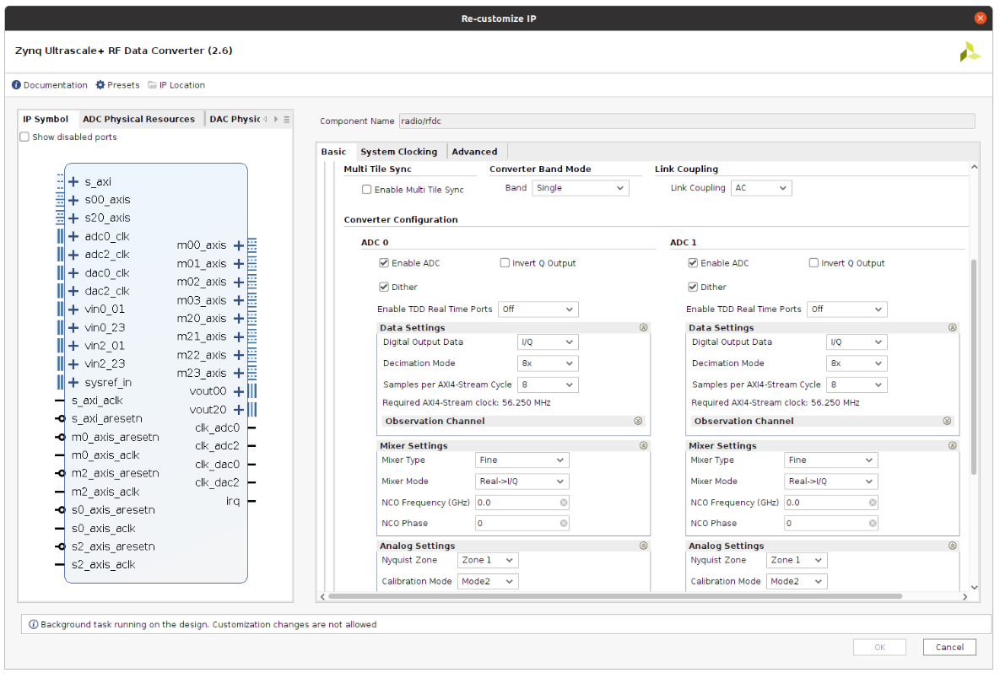
*Figure 10: RF-ADC Tile Configuration Vivado GUI.*

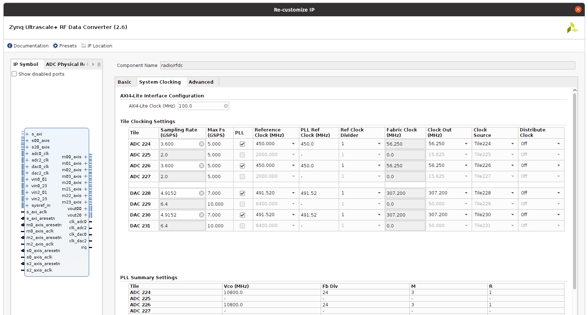
*Figure 11: RF-ADC Clocking Configuration Vivado GUI.*

### FT
Once the received signal that has information from all GNSS bands is translated to baseband, filtered and decimated, it is time to select which particular GNSS carrier frequency should be received by applying a translation from the apparent IF in the global baseband signal to baseband (zeroIF). This frequency translation process can be instantiated several times to complete a multi-band front-end. After applying a second baseband translation, the user can choose which GNSS frequency band they want to work with. In order to do this, it is necessary to pass the signal through a translation and decimation stages again. The first stage is based on programming a Frequency Translator from Vitis HLS and adapting the reception chain in Vivado [9][22] to be able to control this new IP core correctly. Figure 12 shows a summary of the FT concept explanation.

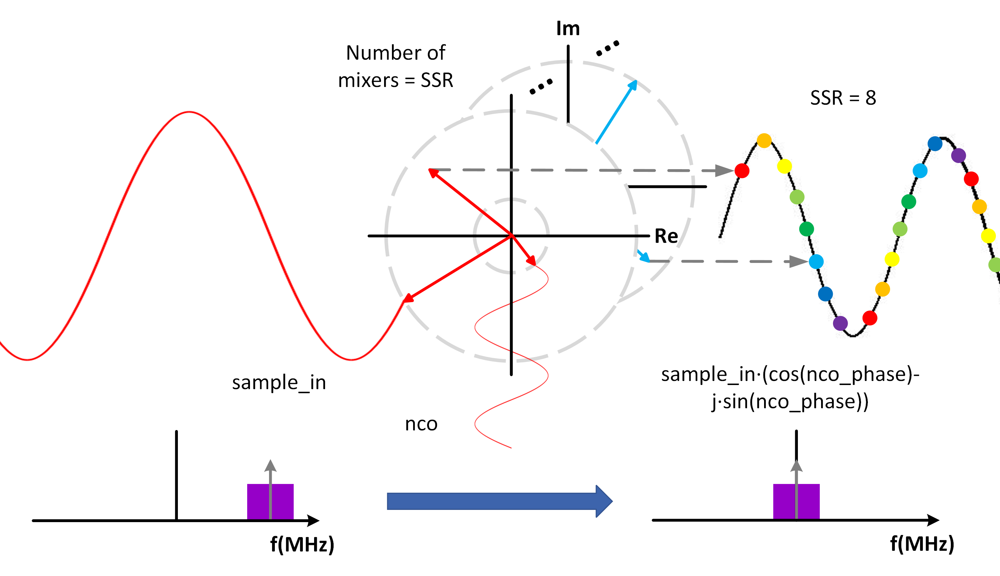
*Figure 12: Frequency Translator concept explanation.*

As the I component and the Q component of the complex signal processed by the RFDC come out through different ports, a multiplexed concatenation is carried out, since the Frequency Translator input is made through a single port. It is true that two input streams could are implemented, but thereby the ’std::complex’ data type would not are used, generating a possible desynchronization of the processed data. This multiplexed concatenation is carried out directly in VHDL from Vivado creating a VHDL model, since thereby the implementation of the block is completely optimized. Creating native VHDL blocks to optimize certain simple processes, such as the one described above, has been a resource that has been used on several occasions throughout the signal processing. Moreover, an AXI GPIO IP core, is added to control the state of the control flags. In this way, the FT can be controlled from the PS.

Finally, to be able to configure the Frequency Translator parameters as those of the AXI GPIO IP core via AXI through the PS, these ports have to add as slaves to the PS block named ’zynq_ultra_ps_e_0’ in the memory map, as shown in Figure 13. To make this connection, the option provided by Vivado is used so that the wiring is automatically generated from the port without connecting to the specified IP core. It should been sured that the wiring does not pass through any other set of blocks than the desire done. If this occurs, once the new IP core is mapped, the relevant wiring should be eliminated and the desired port should be manually connected to the closest AXI Interconnect IP core where the connection of a new port is created. Thereby, when the specific driver for each block is created, the PS will have the memory address to whic hit has to send the information.

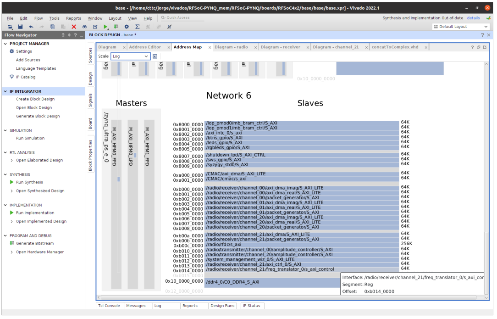
*Figure 13: Frequency Translator memory map.*

### FIR
The Vivado FIR IP core [5] it is responsible for filtering and decimating the signal once it has been transferred to baseband for the second time. The design of its coeficients was carried out using MATLAB’s ’Basic FIR Filter’ tool, shown in Figure 14, and the configuration via the Vivado GUI, changing the Super Sample Rate (SSR) and the decimation factor. Figure 15 shows the summary of the FIR configurations.

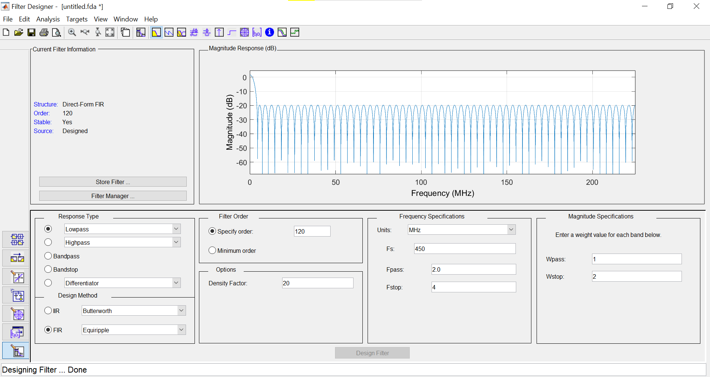
*Figure 14: Designing the filter in MATLAB Filter Design & Analysis Tool.*

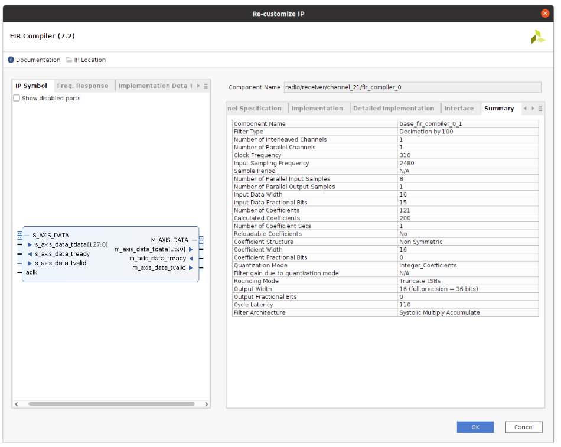
*Figure 15: Summary FIR GUI panel.*

### Chain Selector
To create a system that allows working with several bands at the same time, a sample of each band should be provided to the final device consecutively. In other words, for the final device to be equipped with satellite navigation using several GNSS bands at the same time, it is necessary for the front-end to send it the data of the desired receiving chains consecutively. For this reason, a Chain Selector is implemented in Vitis HLS.

### DMA
The process of configuring the DMA [4] and sending the data via socket has been done through a C program (*dma2udp*) so that the data transfer speed is correct, (4.5MB * 4Bytes * 4Chains = 72MB/s). Otherwise, in Python this rate is not achieved, causing the system to lose samples. A second version of the main Python code (*multipleChain_singleDMA_onlyPYNQ.ipynb*) has been created to verify that the transmission speed is slower. Figure 16 shows the simplified diagram of the different stages through which the data packets pass from the moment they are received by the terrestrial antenna until they are sent to the final device.

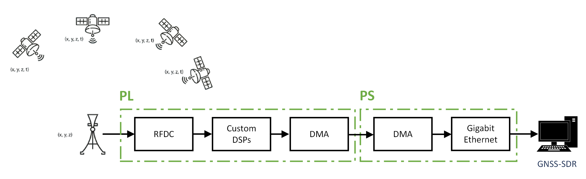
*Figure 16: Packet transmission diagram.*

### Entire front-end behaviour
As a summary, a flowchart is made, shown in Figure 17, which defines the various states that the RFSoC4x2 and its control go through to end up obtaining positioning with the final device. At the beginning, the overlay is loaded, which contains all the instances of the generated IP cores and the drivers to make communication possible between the hardware, software and application layers. The GNSS bands to receive are selected by configuring the Chain Selector. After the signal has been processed by the PL, the dma2udp code transfers the data received from the PL DMA to the Ethernet port of the RFSoC4x2. Furthermore, the processed data is transmitted as User Datagram Protocol (UDP) packets to the specified IP and port through the Ethernet cable to the final device which performs satellite navigation.

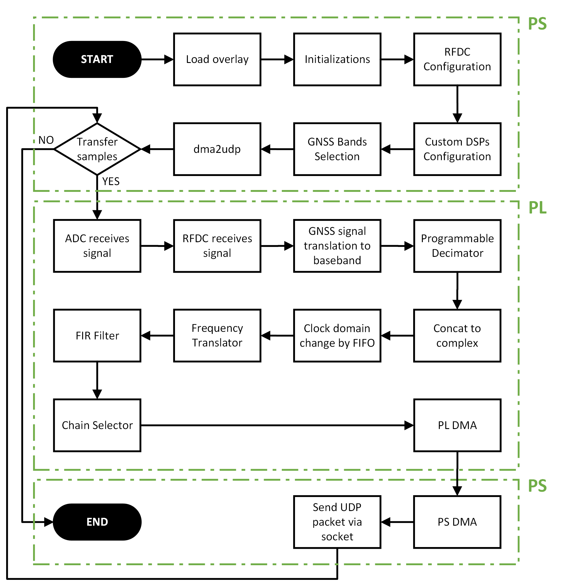
*Figure 17: General flowchart of the project.*

## How to use it

This section details how to proceed in order to use the front-end with either a RFSoC4x2 or a ZCU208. It is recommended to use a ZCU208, since the RFSoC4x2 does not allow reaching an optimal data transmission speed with four chains. This tutorial assumes that the user have or know how to install Vivado, VitisHLS, MATLAB and GNURadio and is using Linux. The tutorial is made with the ZCU208 but is analogous for the RFSoC4x2:

1. Install the pynq boot image v3.0.1 inside of an SD card (https://www.pynq.io/boards.html), insert it into the device and check that the board boot is in SD card mode.
2. Execute *git clone https://github.com/jorgeiglesiasc/advanced-rfsoc-front-end.git* in the terminal.
3. Go to _*/advanced-rfsoc-front-end/Vivado/ZCU208_ and copy the bitstream file (.bit) and the hardware handoff file (.hwh).
4. Go to _*/xilinx/pynq/overlays/base_ inside the ZCU208 (the board password is _xilinx_) and replace the .bit and the .hwh. It is important not to change the name of any of the two files.
5. Go to _*/advanced-rfsoc-front-end/JupyterNotebook_ and copy *multipleChain_singleDMA_system.ipynb*.
6. Go to _*/xilinx/jupyter___notebooks_ inside the ZCU208 and paste *multipleChain_singleDMA_system.ipynb*.
7. Go to _*/advanced-rfsoc-front-end_ and copy *dma2udp* folder.
8. Go to _*/xilinx_ inside the ZCU208 and paste *dma2udp* folder.
9. Go to  _http://ipDevice:portDevice/tree?_ in your browser. _ipDevice_ and _portDevice_ is the IP network and port of the ZCU208.
10. Once inside Jupyter, open *multipleChain_singleDMA_system.ipynb*. This example is done with the ZCU208 ADC channel 20. If the user is using RFSoC4x2, the channel has to be the 21 (ADC_A).
11. When everything in the notebook is set up as desired, click on the forward button (*restart the kernel, then re-run the whole network (with dialog)* button). Then click on *Restart and Run All Cells* button.
12. When all cells are executed, go to the terminal and enter the board with ssh (the board password is _xilinx_).
13. Execute _sudo ./dma2udp_ inside of _*/dma2udp/build_ folder and that's all.

### How to use Vivado
If the user wants to modify the overlay, the project has to be opened with Vivado as follows:
1. Open de _.xpr_ project in Vivado. The path is _*/advanced-rfsoc-front-end/Vivado/ZCU208/ZCU208/base/base_
2. Since Vivado stores the absolute path of the FIR coefficients, two _.coe_ files will appear in Sources->Design Sources->Coefficients Files. The one that does not belong to the corresponding path has to be deleted.
3. Within the design block, the coefficients of the eight FIR filters have to be modified. These are located in radio->receiver->channel_XX, where XX is 20 or 21 depending on the device.

If any modification is made to a custom IP core in Vitis HLS it has to be exported to the _*/advanced-rfsoc-front-end/Vivado/ip_ folder

## Conclusion

By analysing in detail the satellite navigation signals and the RFSoC4x2 development board, equipped with a Zynq Ultrascale+ RFSoC processor, a novel flexible multi-band GNSS SDR front-end was designed and implemented. This project demonstrated that:
- The direct-RF sampling technique allows implementing an 'universal' multi-band front-end for GNSS. It is possible to process a wideband signal with a carrier frequency in the order of 1-2 GHz by sampling it directly with a sampling frequency of 3-4 GSPS, without having an IF stage using an ADC provided by the RFSoC4x2 development board. One DDC can obtain the multiple GNSS bands necessary for the receiver. The front-end receives signals which are downconverted correctly through the RFDC and the Frequency Translator.
- Adding new bands with this system becomes a simple firmware update. Instead of a conventional analog front-ends, with the implemented front-end, adding a new GNSS band only requires instantiating a new processing chain in the PL in Vivado and, with no hardware modifications.
- By using high-level implementation tools, a new custom IP core can be designed, implemented, and controlled very quickly. A straightforward process can be followed to implement a new custom IP core, firstly, its behaviour is programmed and exported in Vitis HLS, and it is instantiated and connected in Vivado, then, the files that contain the behaviour of the hardware layer are exported, and the IP core driver is created in the software layer and, finally, the overlay is loaded, and the IP core is configured.
- Performing configuration and control of the device with Python is simpler and allows to perform tests more quickly, but the problem arises when the programmer want to optimize the execution speed of the program, making Python not the best option. For this reason, the samples have been sent to the final device through DMA in C++ language.

## Future work

The work done in this contribution constitutes the initial seed for several future works, some of them are:
- Test the project in a real acquisition situation and perform satellite navigation.
- Change the entire procedure to C++ to make an optimized program.
- Make the DMA sending part with interrupts.
- Adapt the front-end to other types of RFSoCs.
- Create a system with more chains or more ADCs.
- Test and adapt the project to another type of signal processing objective.

## Bibliography

[1] AMD, UltraScale Architecture Configurable Logic Block User Guide, February 2017.

[2] AMD, Zynq UltraScale+ RFSoC RF Data Converter v2.6 Gen 1/2/3/DFE Logi-CORE IP Product Guide, October 2019.

[3] AMD, ZCU208 Evaluation Board User Guide, July 2020.

[4] AMD, AXI DMA v7.1 LogiCORE IP Product Guide, April 2022.

[5] AMD, FIR Compiler: LogiCORE IP Product Guide, October 2022.

[6] AMD, PYNQ: Python productivity for Adaptive Computing platforms, 2022.

[7] AMD, UltraScale Architecture and Product Data Sheet: Overview , November 2022.

[8] AMD, Vitis High-Level Synthesis User Guide, December 2023.

[9] AMD, Vivado Design Suite User Guide: Designing IP Subsystems Using IP Integrator , October 2023.

[10] AMD, Zynq UltraScale+ RFSoC Data Sheet: DC and AC Switching Characteristics, May 2023.

[11] AMD, Zynq UltraScale+ RFSoC Data Sheet: Overview , June 2023.

[12] AMD, Zynq UltraScale+ RFSoC: Product Brief , 2023.

[13] AMD, Zynq UltraScale+ RFSoC Product Selection Guide, February 2023.

[14] AMD, 2024, pynq boot image: https://www.pynq.io/boards.html.

[15] Calian GNSS, 2024, gnss constellations, bands, frequencies and signals: https://www.tallysman.com/gnss-constellations-radio-frequencies-and-signals/.

[16] C.Fernandez-Prades and J.Arribas, 2024, gnss-sdr project website: https://gnss-sdr.org/.

[17] L. H. Crockett, D. Northcote, and R. W. Stewart, Software Defined Radio with Zynq UltraScale+ RFSoC , University of Strathclyde, Glasgow, Scotland, UK, 2023.

[18] RealDigital, RFSoC 4x2 Reference Manual , 2024.

[19] StrathSDR, 2023, pynq baseoverlay: https://www.rfsoc-pynq.io/overlays.html.

[20] StrathSDR, 2023, rfsoc-book notebooks github: sdr/RFSoC-Book/tree/main/rfsoc book.

[21] StrathSDR, 2024, rfsoc-book website: https://www.rfsocbook.com/.

[22] Xilinx, 2024, vivado ide.
